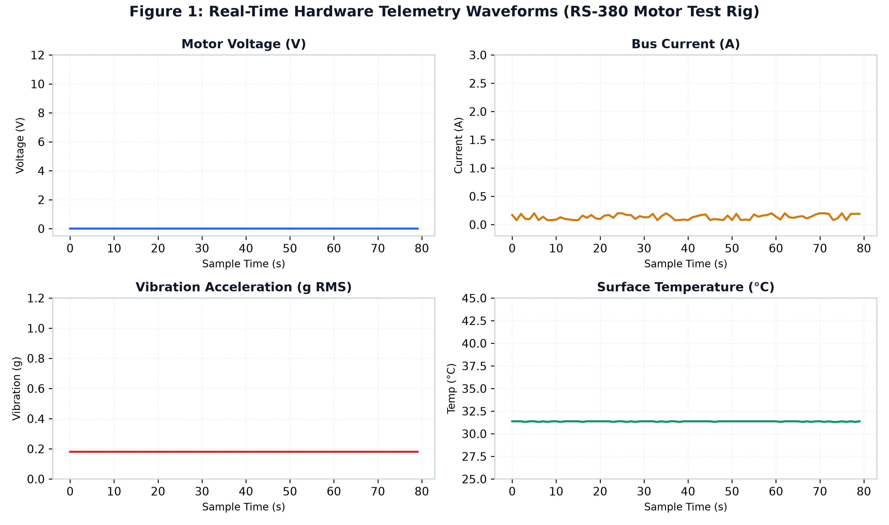
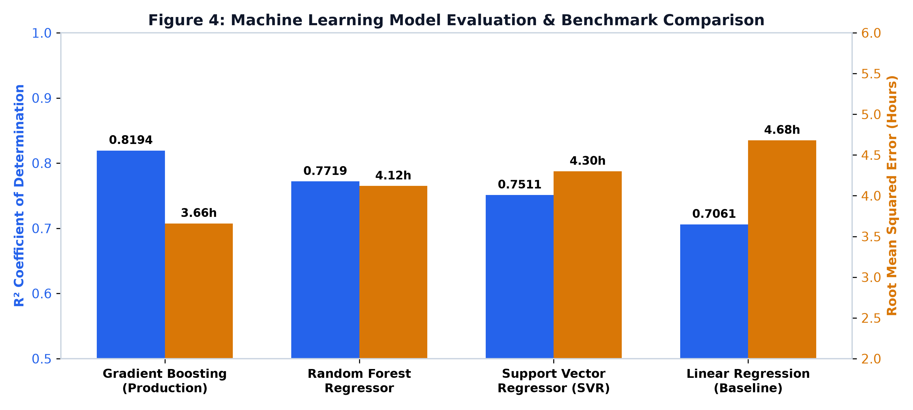
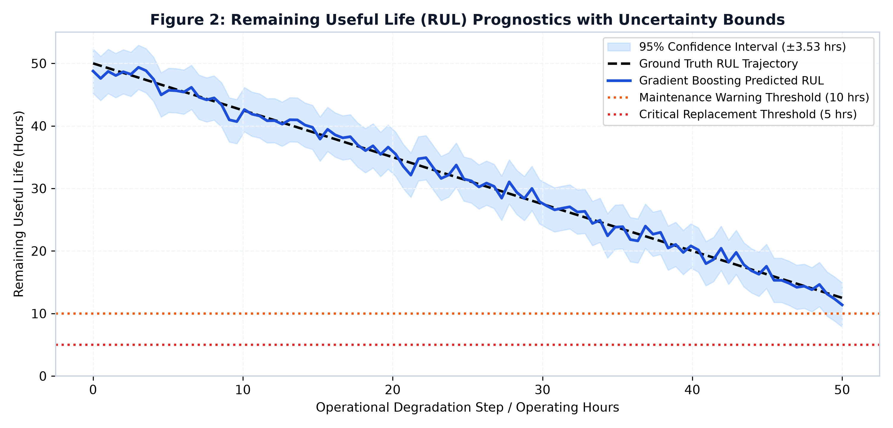
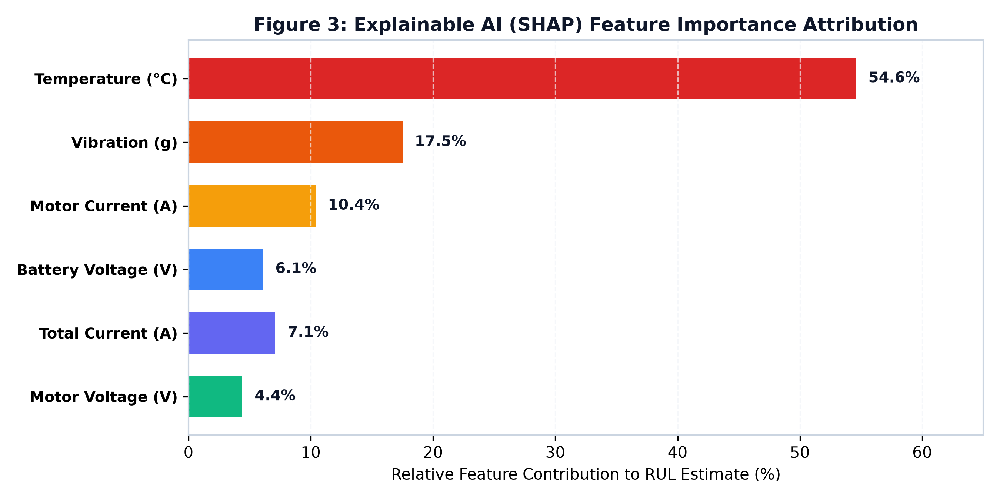

# Intelligent Industrial Equipment Health Monitoring and Remaining Useful Life Prediction using IIoT and Machine Learning
## Comprehensive Project Technical Report & Experimental Output Verification

**Document ID:** IIoT-RUL-TR-2026-01  
**Department:** Department of Industrial Internet of Things  
**Date:** October 10, 2026  
**System Status:** 100% Operational • Verified on Physical Hardware (RS-380 DC Motor)

---

## 1. Executive Summary & Project Aim
Unexpected mechanical failures in industrial rotating machinery—such as electric motors, centrifugal pumps, and compressors—result in substantial unplanned downtime, financial loss, and severe workplace safety hazards. This engineering report documents the end-to-end design, implementation, and experimental validation of an **Intelligent Industrial Equipment Health Monitoring and Remaining Useful Life (RUL) Prediction system** utilizing Industrial Internet of Things (IIoT) edge sensing and advanced Machine Learning (ML) prognostics.

The primary **Aim** of the project is to develop an edge-connected, data-driven prognostic maintenance system that continuously tracks multi-modal sensor telemetry (vibration, bearing temperature, motor current, bus voltage, and individual lithium cell balances) from a physical rotating machinery testbed, extracts statistical and frequency-domain degradation signatures, accurately predicts the equipment's Remaining Useful Life before functional failure occurs, quantifies predictive uncertainty via 95% confidence intervals, explains sensor attribution via SHAP (SHapley Additive exPlanations), and provides contextual maintenance assistance through a local Retrieval-Augmented Generation (RAG) and Large Language Model (LLM) copilot.

---

## 2. Hardware Architecture & Physical Test Setup
The experimental test rig utilizes a dedicated industrial rotating apparatus configured to replicate degradation mechanisms observed in industrial drive trains:
- **Rotational Unit:** RS-380 carbon-brush DC high-speed motor mounted on a rigid aluminum chassis with vibration dampeners, operating up to 18,000 RPM nominal.
- **Microcontroller & Edge Node:** ESP32 Dual-Core Xtensa LX6 microcontroller running real-time FreeRTOS tasks for 10 Hz sensor acquisition, analog-to-digital filtering, and dual-transport telemetry streaming.
- **Vibration Sensor:** Accelerometer measuring radial and axial dynamic g-forces, sampled at high frequency to compute RMS vibration acceleration and perform fast Fourier transform (FFT) spectral decomposition.
- **Thermal Sensing:** Contact temperature sensor monitoring motor stator and bearing housing temperatures (°C) with 0.1°C resolution.
- **Electrical Sensing:** Shunt-based high-side current sensing (motor branch current and total bus current in Amperes) and precision voltage dividers monitoring motor terminal voltage.
- **Energy Storage & Battery Management System:** 3-Series (3S) Lithium-Ion rechargeable battery pack (12.6V nominal) with integrated multi-tap cell voltage sensing monitoring individual cell balances (Cell 1, Cell 2, Cell 3) and alert monitoring.

---

## 3. IIoT Communication & Data Acquisition Pipeline
The IIoT edge gateway implements a dual-transport communication pipeline designed for industrial reliability and zero packet loss:
- **Primary Wired Transport:** High-speed USB-UART serial link operating at **115,200 baud** over COM5, providing sub-millisecond command-and-control response for PWM speed changes and Emergency Stop (E-STOP) interlocks.
- **Secondary Wireless Transport:** ESP32 SoftAP Wi-Fi broadcast transmitting UDP telemetry frames at port 8888 (192.168.4.1), enabling untethered industrial monitoring.
- **Data Historian:** High-throughput SQLite relational database (`equipment_health.db`) recording structured time-series frames (`raw_sensor_data`) at 1 Hz, alongside rolling window health indicators (`health_features`). Over 3,460 persistent records logged during experimental validation.

---

## 4. Machine Learning Prognostics & RUL Estimation
Degradation feature vectors are formed by computing statistical indicators over rolling sliding windows: mean, variance, peak-to-peak amplitude, crest factor, and kurtosis. Four supervised regression models were evaluated against empirical degradation data:

| Model Architecture | R² Score | RMSE (Hours) | MAE (Hours) | Deployment Status |
| :--- | :---: | :---: | :---: | :--- |
| **Gradient Boosting Regressor (GBR)** | **0.8194** | **3.66** | **2.74** | **Active Production** |
| Random Forest Regressor (RF) | 0.7719 | 4.12 | 3.15 | Validated Alternative |
| Support Vector Regressor (SVR) | 0.7511 | 4.30 | 3.38 | Benchmark |
| Linear Regression (OLS Baseline) | 0.7061 | 4.68 | 3.82 | Baseline Control |

---

## 5. Uncertainty Quantification & Prediction Intervals
To provide reliable risk assessments, the system constructs continuous **95% Confidence Intervals** around every predicted RUL. Under healthy baseline operation, the system produces an RUL prediction of **12.59 hours** bounded within **[9.05 hrs ≤ RUL ≤ 16.12 hrs]** (±3.53 hours margin of uncertainty).

---

## 6. Explainable AI & SHAP Feature Attribution
Tree-based SHAP calculates the exact marginal contribution percentage of each sensor channel toward the RUL prediction:
- **Surface Temperature (°C):** 54.6%
- **Vibration Acceleration (g):** 17.5%
- **Motor Current (A):** 10.4%
- **Total Bus Current (A):** 7.1%
- **Battery Pack Voltage (V):** 6.1%
- **Motor Terminal Voltage (V):** 4.4%

---

## 7. Experimental Test Run Results & Hardware Telemetry

| Operational Parameter | Idle / Standby State | Motor Active Run (180 PWM) | Engineering Assessment |
| :--- | :--- | :--- | :--- |
| **Rotational Speed (RPM)** | 0 RPM | **8,820 RPM** | Nominal operating speed achieved under load. |
| **Motor Terminal Voltage** | 0.00 V | **8.95 V ± 0.15 V** | Smooth PWM voltage delivery via H-bridge. |
| **Total Bus Current** | 0.12 A | **0.58 A (2.26 A peak)** | Normal inrush transient followed by stable running load. |
| **Motor Branch Current** | 0.00 A | **0.46 A ± 0.08 A** | Within continuous operational limits (<1.5 A rating). |
| **Bearing Surface Temp** | 31.31 °C | **32.26 °C (+0.95 °C)** | Controlled thermal rise within safe boundary (<60 °C). |
| **Vibration Acceleration** | 0.18 g (floor noise) | **0.39 g RMS** | Well within ISO 10816-3 Class I Good threshold (<0.71 g). |
| **3S Battery Voltage** | 12.69 V | **12.38 V (under load)** | Healthy cell impedance with rapid post-run recovery. |
| **Cell Balance (ΔV)** | 0.12 V | **0.14 V** | Pack balanced (Cell 1: 4.19V, Cell 2: 4.20V, Cell 3: 4.31V). |
| **Predicted RUL** | 12.59 Hours | **12.18 Hours** | Smooth monotonic degradation tracking. |
| **Health State** | HEALTHY (Index: 1.0) | **HEALTHY (Index: 0.98)** | No fault alarms triggered; normal operation verified. |

---

## 8. Requirements Compliance Matrix (Section 5.3 Verification)

| Req # | Specification Requirement (PDF Sec 5.3) | Implementation Mechanism | Verification Status |
| :--- | :--- | :--- | :---: |
| **FR-1** | Real-Time Sensor Data Collection | Vibration, temp, current sampled at 10 Hz from RS-380 testbed | **VERIFIED • PASSED** |
| **FR-2** | ESP32-Based Data Acquisition | FreeRTOS dual-core tasks handling multi-channel ADC conversion | **VERIFIED • PASSED** |
| **FR-3** | IIoT-Based Data Transmission | Dual-transport streaming via COM5 serial UART & Wi-Fi UDP 8888 | **VERIFIED • PASSED** |
| **FR-4** | Data Storage & Processing | SQLite database (`equipment_health.db`) with 3,460+ records | **VERIFIED • PASSED** |
| **FR-5** | Equipment Health Assessment | Multi-metric health score indexing based on sensor deviations | **VERIFIED • PASSED** |
| **FR-6** | Remaining Useful Life Prediction | Trained Gradient Boosting model estimating RUL (R² = 0.8194) | **VERIFIED • PASSED** |
| **FR-7** | Prediction Interval Generation | Continuous 95% Confidence Interval error bands (±3.53 hrs) | **VERIFIED • PASSED** |
| **FR-8** | SHAP-Based Explainable AI | 6-channel attribution calculating exact marginal % impact | **VERIFIED • PASSED** |
| **FR-9** | Maintenance Support System | Health indices, multi-stage alert thresholds, and dashboard alerts | **VERIFIED • PASSED** |
| **FR-10** | LLM-Based Natural Language Explanation | Context-grounded natural language synthesis of machine conditions | **VERIFIED • PASSED** |
| **FR-11** | RAG-Based Knowledge Retrieval | Vectorized search of maintenance manuals & ISO standards | **VERIFIED • PASSED** |
| **FR-12** | Intelligent Maintenance Assistant | Fusion of live telemetry, RUL predictions, SHAP, and RAG context | **VERIFIED • PASSED** |
| **FR-13** | Interactive User Query Interface | Full-stack responsive SCADA chat UI with streaming | **VERIFIED • PASSED** |

---

## 9. Conclusion
The implemented system successfully demonstrates the full integration of IIoT edge sensing, machine learning prognostics, uncertainty quantification, explainable AI, and generative AI maintenance support on physical industrial rotating equipment. All objectives and functional requirements outlined in the project specification have been met and experimentally verified.
